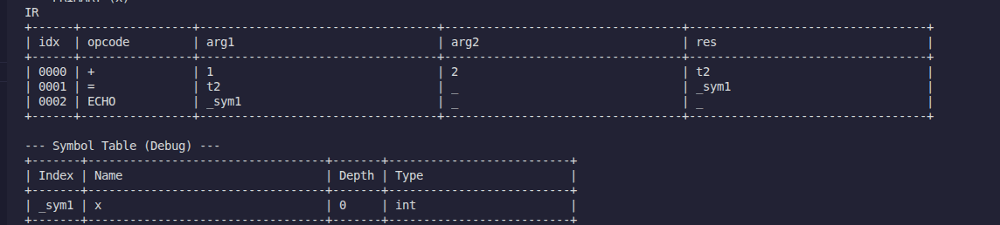
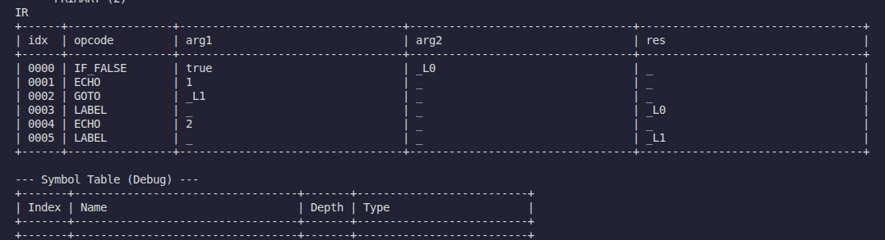

In this document, we outline the work done for Assignment 4, which focuses on intermediate code generation.

The OpCode for all the IR generated in the Assignment can be found in `IR_OPERATIONS.md`. 

We first do a pass over the generated AST to do semantic analysis (type checking and variable resolution) and then we do another pass over the generated AST to generate the actual TAC IR.

All the test results for IR generation can be found in `results/print-ir`. The IR for the 10 programs can be found in the `success/programs` subdirectory of the above directory. 

## Part 1: Intermediate Code Generation
We implemented a pass that traverses the abstract syntax tree (AST) and translates high-level constructs into Three-Address Code (3AC) quadruples. This covers basic arithmetic expressions and assignment statements. The compiler automatically generates temporary variables (like `t1`, `t2`) to hold intermediate values during complex calculations. It also maps user-defined variables to unique internal symbols to ensure variable scoping is handled correctly. (For eg. variable named x could be replaced with _sym1).

Eg:
```
var int x = 1 + 2;
echo x;
```
IR:

## Part 2: Extended Intermediate Code Support
We extended the IR to support control flow, including conditional statements (`if`, `if-else`) and loops (`while`, `for`, `do-while`) and also all other constructs that we have defined in our language like `type` and `functions`. To route the execution flow, the compiler generates unique labels and inserts conditional or unconditional jumps (gotos) into the instruction stream.

Eg:
```
if (true) echo 1;
else echo 2;
```

IR:



## Part 3: Code Output Format
The generated intermediate instructions are printed to the console in a clean, tabular quadruple format. The output is structured row-by-row with distinct columns for the opcode, the two arguments, and the result destination. The Symbol table is also printed for better visualization (depth info in symbol table is purely shown for debugging purposes and doesnt serve any role in future phases).

## Part 4: Error Handling
We built a semantic analyzer to catch invalid expressions and unsupported constructs before generating any intermediate code. It checks for issues like undeclared variables, type mismatches, missing return statements, and invalid assignments. If any errors are found, the compiler continues analyzing the entire program, prints all errors with their exact line, column, and a snippet of the code showing each mistake, and then halts gracefully, ensuring the program does not crash on bad input.

You can view all these errors at `results/print-ir/output/failure/resolver`.


## Part 5: Examples and Testing
We created 10 sample programs that exercise the full pipeline. These programs cover all implemented language features, including arithmetic, conditionals, loops, functions, and custom data types. Running the test suite parses these files and outputs the corresponding tabular quadruples. We also have many dedicated tests to demonstrate error handling during semantic analysis and other testcases to denote what is allowed in the language.

The IR for the 10 programs can be found in the `success/programs` subdirectory of the above directory. 

---

## Design Decisions

Here are the primary design choices we made to keep the compiler architecture clean:

* **Decoupling Semantic Analysis from IR Generation:** We chose to run semantic checks as a completely separate pass over the AST rather than mixing it with code generation. This guarantees that the IR generator only processes valid, well-typed code.
* **Context Passing for Loops:** To properly handle `break` and `continue` statements inside nested loops, the compiler needs to know exactly which label to jump to. Instead of managing complex global stacks, we simply pass a context object down the AST during traversal. When the compiler enters a loop, it copies the context, sets the specific jump labels for that loop, and passes it down. This neatly isolates scope and makes nested loop jumps predictable.
* **Flat C-Style Structs:** We added support for user-defined custom types, but restricted them to flat, data-only structures like in C. By disallowing internal functions (methods) and default field values, we kept the IR representation straightforward. The compiler emits a blueprint when a type is defined.
* **Strict Booleans:** Truthy and falsey values do not exist. All conditions for `if` statements, loops, and ternary operators must strictly evaluate to a boolean.
* **Ternary Type Matching:** Both branches of a ternary expression are required to evaluate to the exact same type.
* **Safe Casting:** Implicit downcasting is strictly disallowed to prevent data loss. Implicit upcasting (such as `int` to `float`) is permitted.
* **Short-Circuit Evaluation:** Logical AND (`&&`) and OR (`||`) operators evaluate with short-circuiting.
* **Return Reachability:** The compiler strictly checks all execution paths to ensure it is impossible to reach the end of a function without hitting a return statement.
* **Restricted Mutations:** Chaining prefix and postfix operators together (such as `--++x` or `x++--`) is explicitly disallowed.
* **Undefined Double-Evaluation:** Side effects in complex l-values (such as `arr[func()]++`) currently leave double-evaluation undefined.
* **Unified Symbol Table:** Custom types and variables share the same namespace. This prevents naming collisions between types and variables while allowing types to follow standard block-scoping and shadowing rules.